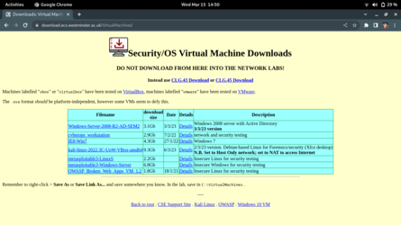

# Week 01

## Lab Setup 

> This is only required to be done once. 
Following virtual machines are initially configured. 

- Kali Linux
- OWASP 

Downloading university provided VM Virtual Machines [Link](https://download.ecs.westminster.ac.uk/VirtualMachines/)

