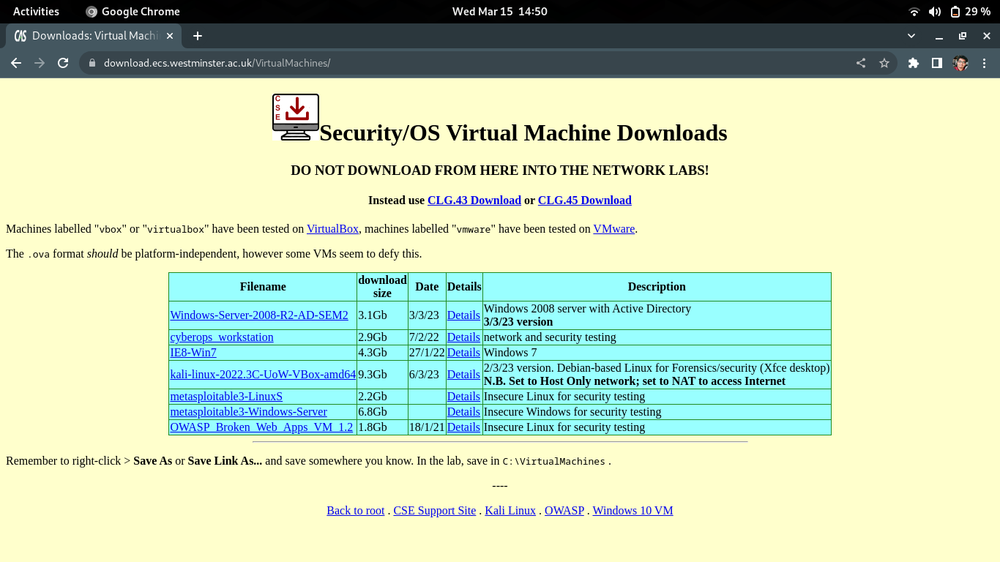

# Week 01

## Lab Setup 

Throughout the module you will be using following virtual box images.

- Kali Linux
- OWASP
- Windows 7

:::{note}
This is only required to be done once.
:::

But for the inital Lab Sessions following virtual machines are initially configured.

- Kali Linux
- OWASP 

when required we will look into configuring rest of the images.

Downloading university provided VM Virtual Machines [Link](https://download.ecs.westminster.ac.uk/VirtualMachines/)

