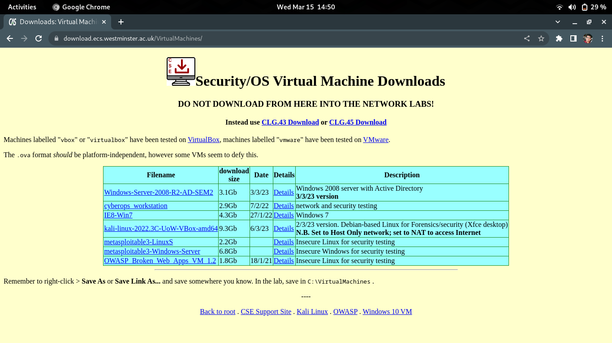
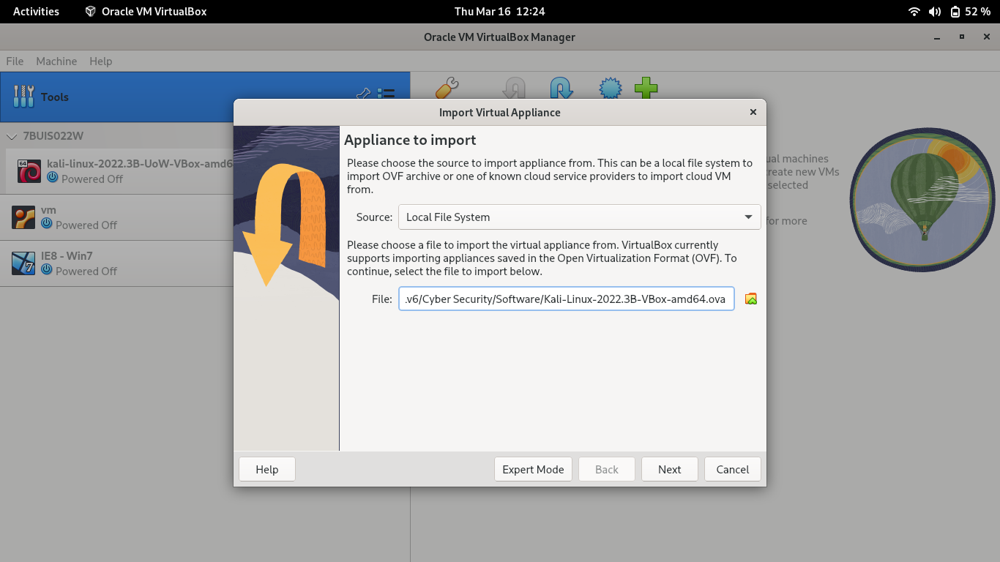
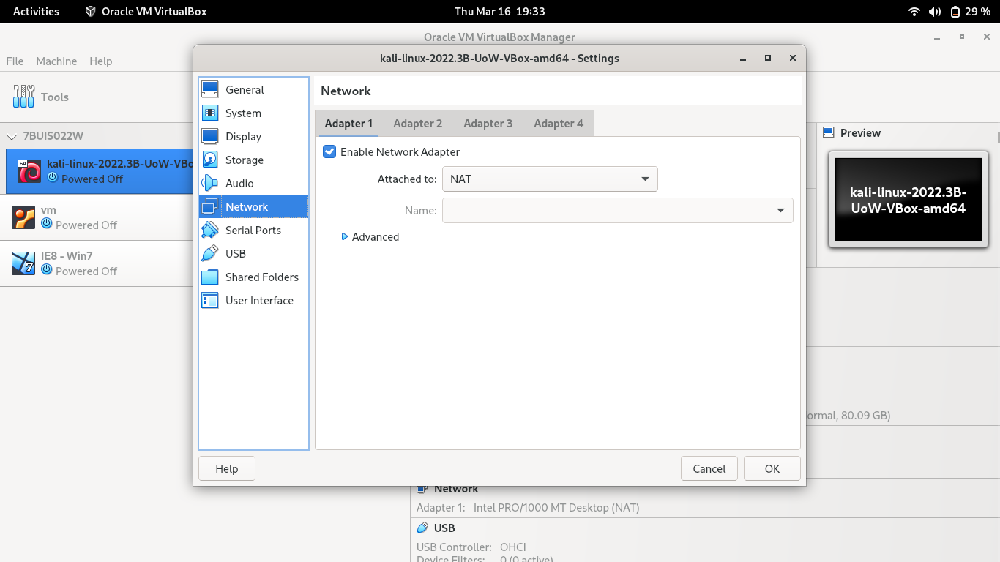
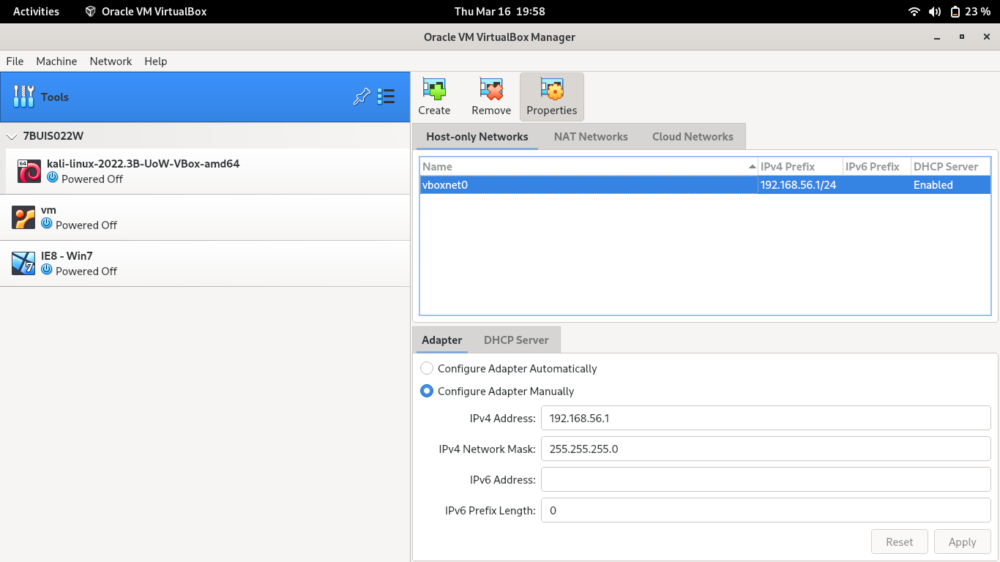
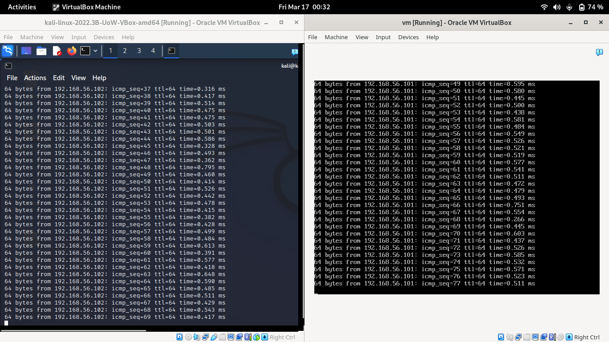

# Week 01

## Lab Setup 

### Virtualization Software  

[Oracle Virtual Box](https://www.virtualbox.org/wiki/Downloads) will be used as the virtualization software for tutorials. 

:::{caution}
Currently there is no proper support for ARM based systems with Virtual Box.
:::

### Virtual Box Images 
Throughout the module you will be using following virtual box images.

- Kali Linux
- OWASP
- Windows 7

:::{note}
This is only required to be done once.
:::

But for the initial Lab Sessions following virtual machines are initially configured.

- Kali Linux
- OWASP 

when required we will look into configuring rest of the images.

Downloading university provided VM Virtual Machines [UOW Intranet](https://download.ecs.westminster.ac.uk/VirtualMachines/)



### Importing OVF files 

Shared virtual box OVF (Open Virtualization Format) files will be imported as initialized into local system. 

- Default machine configurations were used. No settings were changed during import.

- Default login information

|OS | User Name | Password|
|---|-----------|---------|
|Kali-Linux|kali|kali     |
|OWASP| root    | owaspbwa|
|Win-7|admin    |Passw0rd!|



## Network Setup

### Internet Connected

:::{note}
Only the Kali Linux machine is required to be connected to Internet.
:::

Using NAT options to enable Internet access to Virtual Machines

- Select the target Virtual Machine 
- Goto Machine Settings 
- Under network Section in settings Select the Adapter
- Select `Attached to` as `NAT`


### Isolated Network

:::{tip}
Use Host Only Network when the tutorial only involves host machines and not internet is needed.
:::

Using Host Only options to enable Internet access to Virtual Machines

- Select the target Virtual Machine 
- Goto Machine Settings 
- Under network Section in settings Select the Adapter
- Select `Attached to` as `Host-only adapter` 

If needed refer to [Configuring Network Adapters](#configuring-network-adapters) Section on how to setup new network adapter.


### Configuring Network Adapters

- Select Virtual Box Tools Section
- Go into network configuration
- Add new network adapter with `create` menu
- Set in the required configurations 

:::{tip}
Optionally if required DHCP server can be enabled if needed.
:::



## Updating Linux (Debian Based)

Following procedure is done to ensure the system is running with all the recent updates.

:::{warning}
You will be using `sudo` to conduct a super-user level task.
:::

:::{tip}
This operation requires access to Internet. Using [NAT](#internet-connected) network adapter will enable this.
:::

```bash
sudo apt-get update     # Update the repository
sudo apt-get upgrade    # Upgrade the system
```

## Restarting Network Interfaces 

In certain cases if the network interface is not visible try the following.

:::{warning}
This assumes your system is utilizing System.d
:::

```bash
sudo service network-manager restart
```
## Testing connectivity among VM's in a Isolated Network  

:::{tip}
This operation requires VM's to be in a Isolated Network. 
Consider Host-only adapter
:::

### Check Kali Machine
- Log in to the system
- Open a terminal
- check the assigned IP address with `ifconfig`. 
- In this case it was assigned `192.168.56.101`

### Check OWASP Machine (Vulnerable)
- Log in to the system
- check the assigned IP address with `ifconfig`. 
- In this case it was assigned `192.168.56.102`

### Communicating among VM's  

Let's simulate attacker machine to host communication
From kali machine `ping` the owasp machine

```bash
ping 192.168.56.102
```
simulate host machine to attacker communication
From OWASP machine `ping` the Kali machine

```bash
ping 192.168.56.101
```

