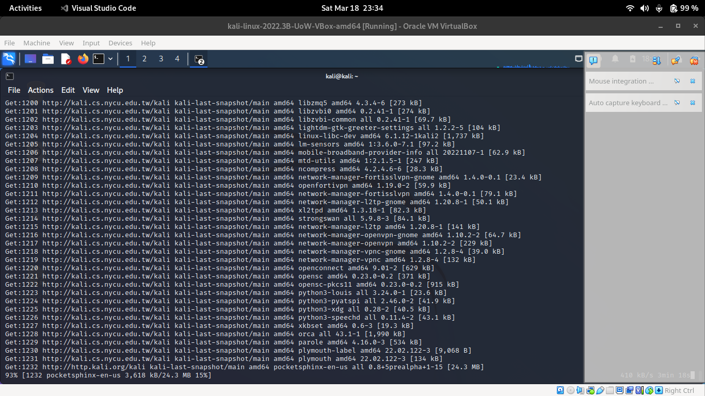

# Week 02

## Introduction to Linux

### The linux shell

Linux shell is command linux interaction software and considered the primary way of communication with the system.

To access the terminal withing Linux Desktop environment a graphical program which emulate the shell will be used. 

Here are few of the commands commonly used: 

```bash
date # displays current date and time
Sat Mar 18 03:43:23 AM EDT 2023
```

```bash
df #current amount of free space in disks
Filesystem     1K-blocks     Used Available Use% Mounted on
udev              976728        0    976728   0% /dev
tmpfs             202884      932    201952   1% /run
/dev/sda1       82083148 14505132  63362468  19% /
tmpfs            1014404        0   1014404   0% /dev/shm
tmpfs               5120        0      5120   0% /run/lock
tmpfs             202880       72    202808   1% /run/user/1000
```


```bash
free #current amount of free space in memory
               total        used        free      shared  buff/cache   available
Mem:         2028812      574468     1046908        5324      407436     1303992
Swap:        1048572           0     1048572
```

```bash
history #remembers the commands history
   81  ping 192.168.56.102
   82  shutdown 0
   83  date
   84  df
   85  free
   86  history
```

```bash
exit #exits the terminal
```

### Navigating the file system

```bash
pwd #shows the current working directory
/home/kali
```
```bash
ls #lists the files and in the current working directory
Desktop  Documents  Downloads  etcresolv.conf  MSc-UoW  Music  Pictures  Public  result.txt  scanlist.txt  Templates  Videos  zap-owasp
ls -a  #lists all files including hidden
.                 .cache     etcresolv.conf  .lesshst  .profile                   .vboxclient-clipboard.pid         .Xauthority           .zshrc
..                .config    .face           .local    Public                     .vboxclient-display-svga-x11.pid  .xsession-errors
.bash_history     Desktop    .face.icon      .mozilla  result.txt                 .vboxclient-draganddrop.pid       .xsession-errors.old
.bash_logout      .dmrc      .gnupg          MSc-UoW   scanlist.txt               .vboxclient-seamless.pid          .ZAP
.bashrc           Documents  .ICEauthority   Music     .sudo_as_admin_successful  Videos                            zap-owasp
.bashrc.original  Downloads  .java           Pictures  Templates                  .wget-hsts                        .zsh_history
ls -d #lists the directory themselves not content
.
ls -F #Appends character to the printed list to indicate type
Desktop/  Documents/  Downloads/  etcresolv.conf  MSc-UoW/  Music/  Pictures/  Public/  result.txt  scanlist.txt  Templates/  Videos/  zap-owasp/
ls -s -h #Human Readable with -h
total 52K
4.0K Desktop    4.0K Downloads       4.0K MSc-UoW  4.0K Pictures  4.0K result.txt    4.0K Templates  4.0K zap-owasp
4.0K Documents  4.0K etcresolv.conf  4.0K Music    4.0K Public    4.0K scanlist.txt  4.0K Videos
ls -s -l #long format
total 52
4 drwxr-xr-x 2 kali kali 4096 Mar 14 05:49 Desktop
4 drwxr-xr-x 2 kali kali 4096 Sep 22 07:32 Documents
4 drwxr-xr-x 2 kali kali 4096 Jan 25 08:29 Downloads
4 -rw-r--r-- 1 root root   19 Mar 14 04:16 etcresolv.conf
4 drwxr-xr-x 3 kali kali 4096 Jan 25 08:36 MSc-UoW
4 drwxr-xr-x 2 kali kali 4096 Sep 22 07:14 Music
4 drwxr-xr-x 2 kali kali 4096 Sep 22 07:14 Pictures
4 drwxr-xr-x 2 kali kali 4096 Sep 22 07:14 Public
4 -rw-r--r-- 1 kali kali  378 Mar 14 04:49 result.txt
4 -rw-r--r-- 1 kali kali   15 Mar 14 05:00 scanlist.txt
4 drwxr-xr-x 2 kali kali 4096 Sep 22 07:14 Templates
4 drwxr-xr-x 2 kali kali 4096 Sep 22 07:14 Videos
4 drwxr-xr-x 9 kali kali 4096 Jan  1  1970 zap-owasp
```

```bash
cd /bin #changes working dir to /bin
cd    #changes working dir to home
cd -  #Changes back to previous working Dir
cd .. #moves to parent working dir
cd ~  #moves to home dir
```
```bash
file pieChartTube.py #Determines the file type
pieChartTube.py: ASCII text
```

```bash
less /etc/passwd #can be used to view text files
root:x:0:0:root:/root:/usr/bin/zsh
daemon:x:1:1:daemon:/usr/sbin:/usr/sbin/nologin
bin:x:2:2:bin:/bin:/usr/sbin/nologin
sys:x:3:3:sys:/dev:/usr/sbin/nologin

```
### Who is logged in 

```bash
whoami # To check on which user account you have logged in with
kali
```
### Files and Directories

```bash
mkdir lab1 #create a new directory in current working dir
```
```bash
cp pieChartTube.py ../ #copy files last args is the target destination
```

```bash
mv pieChartTube.py ../ #move and rename files or directory. 
```
```bash
rm ../pieChartTube.py #delete files
```

### Text Manipulation

```bash
cat /etc/adduser.conf # displays content of files
```

```bash
head /etc/adduser.conf # displays first few lines of the file
# /etc/adduser.conf: `adduser' configuration.
# See adduser(8) and adduser.conf(5) for full documentation.

# A commented out setting indicates that this is the default in the
# code. If you need to change those settings, remove the comment and
# make your intended change.

# The DSHELL variable specifies the default login shell on your
# system.
#DSHELL=/bin/bash

head -20 /etc/adduser.conf #show first 20 lines 
# /etc/adduser.conf: `adduser' configuration.
# See adduser(8) and adduser.conf(5) for full documentation.

# A commented out setting indicates that this is the default in the
# code. If you need to change those settings, remove the comment and
# make your intended change.

# The DSHELL variable specifies the default login shell on your
# system.
#DSHELL=/bin/bash

# The DHOME variable specifies the directory containing users' home
# directories.
#DHOME=/home

# If GROUPHOMES is "yes", then the home directories will be created as
# /home/groupname/user.
#GROUPHOMES=no

# If LETTERHOMES is "yes", then the created home directories will have
```

```bash
tail /etc/adduser.conf #view last few lines of the file 
# If ADD_EXTRA_GROUPS is set to something non-zero, the EXTRA_GROUPS
# option above will be default behavior for adding new, non-system users
#ADD_EXTRA_GROUPS=0

# check user and group names also against this regular expression.
#NAME_REGEX="^[a-z][-a-z0-9_]*\$?$"

# check system user and group names also against this regular expression.
#SYS_NAME_REGEX="^[a-z_][-a-z0-9_]*\$?$"
DIR_MODE=0755
tail -20 /etc/adduser.conf #view last 20 lines
# If SKEL_IGNORE_REGEX is set, adduser will ignore files matching this
# regular expression when creating a new home directory
#SKEL_IGNORE_REGEX="(dpkg|ucf)-(old|new|dist|save)"

# Set this if you want the --add-extra-groups option to adduser to add
# new users to other groups.
# This is the list of groups that new non-system users will be added to
# Default:
#EXTRA_GROUPS="users"

# If ADD_EXTRA_GROUPS is set to something non-zero, the EXTRA_GROUPS
# option above will be default behavior for adding new, non-system users
#ADD_EXTRA_GROUPS=0

# check user and group names also against this regular expression.
#NAME_REGEX="^[a-z][-a-z0-9_]*\$?$"

# check system user and group names also against this regular expression.
#SYS_NAME_REGEX=" 
```

```bash
nl etc/adduser.conf #displays text with numbered 
     1  # /etc/adduser.conf: `adduser' configuration.
     2  # See adduser(8) and adduser.conf(5) for full documentation.
       
     3  # A commented out setting indicates that this is the default in the
     4  # code. If you need to change those settings, remove the comment and
     5  # make your intended change.
       
     6  # The DSHELL variable specifies the default login shell on your
     7  # system.
     8  #DSHELL=/bin/bash
```

### File Permission 

Using `chmod` to set in permissions for files 

```bash
./test.sh #unable to execute
bash: ./test.sh: Permission denied
sudo chmod 755 ./test.sh  #Changing permission
./test.sh #now can execute
hello world!
```

### Networking

Getting to know your Ip Address 

This can be achieved with `ifconfig`, `ip address` or `ip a`.

```bash
ifconfig #Displays network interface info
eth0: flags=4163<UP,BROADCAST,RUNNING,MULTICAST>  mtu 1500
        inet 192.168.56.101  netmask 255.255.255.0  broadcast 192.168.56.255
        inet6 fe80::59a6:d3fd:ec4:1c4  prefixlen 64  scopeid 0x20<link>
        ether 08:00:27:81:f2:46  txqueuelen 1000  (Ethernet)
        RX packets 218  bytes 70416 (68.7 KiB)
        RX errors 0  dropped 0  overruns 0  frame 0
        TX packets 249  bytes 44928 (43.8 KiB)
        TX errors 0  dropped 0 overruns 0  carrier 0  collisions 0

lo: flags=73<UP,LOOPBACK,RUNNING>  mtu 65536
        inet 127.0.0.1  netmask 255.0.0.0
        inet6 ::1  prefixlen 128  scopeid 0x10<host>
        loop  txqueuelen 1000  (Local Loopback)
        RX packets 4  bytes 240 (240.0 B)
        RX errors 0  dropped 0  overruns 0  frame 0
        TX packets 4  bytes 240 (240.0 B)
        TX errors 0  dropped 0 overruns 0  carrier 0  collisions 0
```

```bash
ip address #display network interface info same as ip a
1: lo: <LOOPBACK,UP,LOWER_UP> mtu 65536 qdisc noqueue state UNKNOWN group default qlen 1000
    link/loopback 00:00:00:00:00:00 brd 00:00:00:00:00:00
    inet 127.0.0.1/8 scope host lo
       valid_lft forever preferred_lft forever
    inet6 ::1/128 scope host 
       valid_lft forever preferred_lft forever
2: eth0: <BROADCAST,MULTICAST,UP,LOWER_UP> mtu 1500 qdisc fq_codel state UP group default qlen 1000
    link/ether 08:00:27:81:f2:46 brd ff:ff:ff:ff:ff:ff
    inet 192.168.56.101/24 brd 192.168.56.255 scope global dynamic noprefixroute eth0
       valid_lft 523sec preferred_lft 523sec
    inet6 fe80::59a6:d3fd:ec4:1c4/64 scope link noprefixroute 
       valid_lft forever preferred_lft forever
```

Turning network interfaces up and down with `ifconfig`

:::{note}
`ifconfig` is a part of net-tools package. if the command is not available use the package manager to install it.s
:::

:::{tip}
This operation will require super user privileges
:::

```bash
# eth0 is the network interface 
# down is the status we want to archive 
sudo ifconfig eth0 down 
# up is the status we want to archive 
sudo ifconfig eth0 up
```

Setting a IP address for a interface 

```bash
# eth0 is the network interface 
# 192.168.56.10 is the Ip address 
# 255.255.255.0 is the netmask
sudo ifconfig eth0 192.168.56.10 netmask 255.255.255.0   
```

Request Ip address form DHCP server `dhclient`

```bash
# eth0 is the network interface 
# will get a IP address from DHCP server
sudo dhclient eth0   
```
Checking for wireless interfaces with `iwconfig`

```bash
iwconfig
lo        no wireless extensions.

eth0      no wireless extensions.
```

### Adding or removing software (APT-Debian)

In this we will use `apt` package manager to install and manage software packages.

:::{note}
Sometime you may need to alter `/etc/apt/sources.list` 
To enable some repositories.

- deb-src http://http.kali.org/kali kali-rolling main contrib non-free
- deb http://http.kali.org/kali kali-last-snapshot main contrib non-free non-free-firmware
:::

:::{tip}
Since we are connecting to the internet to fetch packages setting network settings to [NAT](./week_01.md/#internet-connected) will help.
:::

Let's install package with package manager (APT).

```bash
# installing chromium
sudo apt-get install chromium
```

Removing/purge a package with package manager (APT).

```bash
# remove chromium 
# this will not remove the configurations of the package
sudo apt-get remove chromium
```

```bash
# purge chromium 
# purge will remove the package and remove configuration. 
sudo apt-get purge chromium
```

Keeping the system update with latest repository links (APT).

```bash
# System repository will be updated 
sudo apt-get update
```


### Using Pipes 

Pipes allow the information to flow. Using pipes you can move output of a one command to another commands input. 

```bash
echo "this is my first Linux lab"| wc
      1       6      27
```