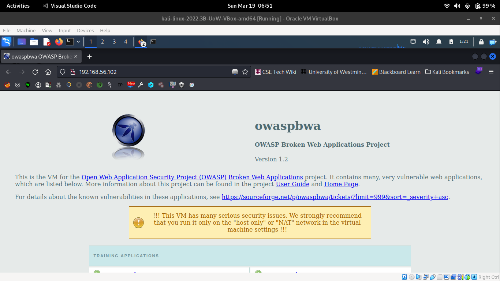
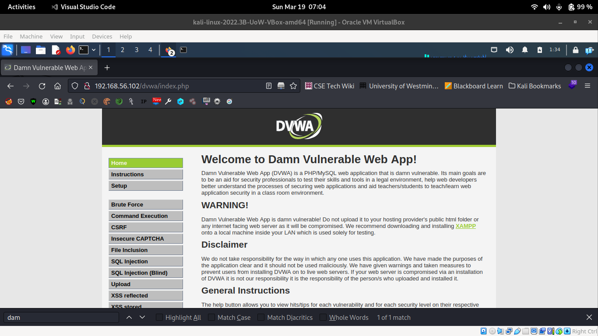
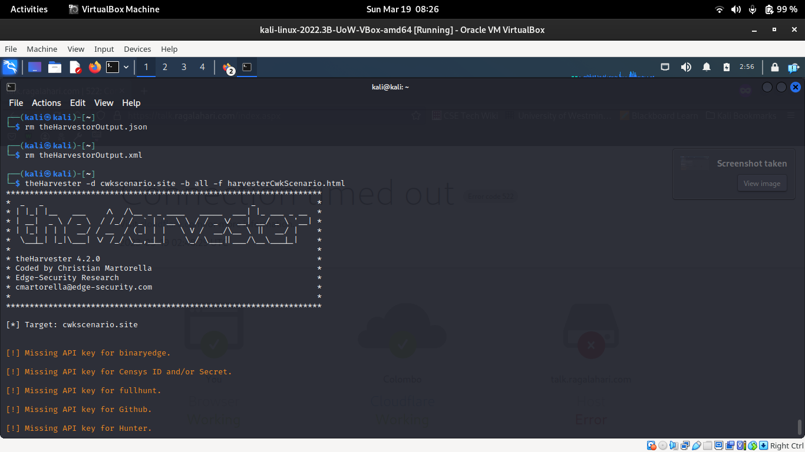
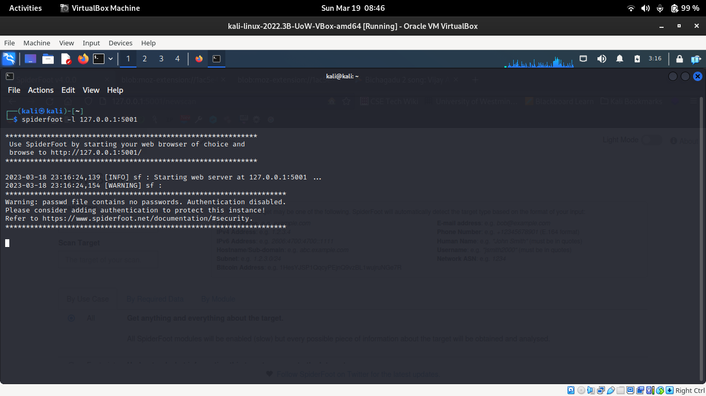
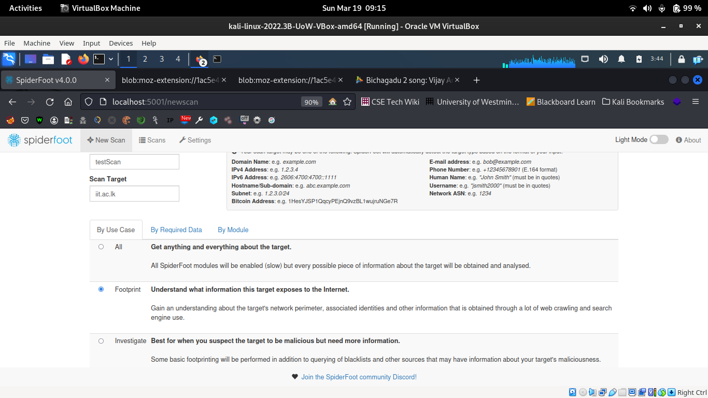
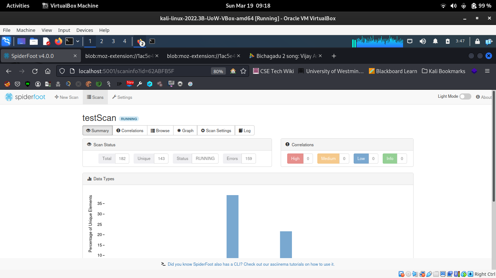
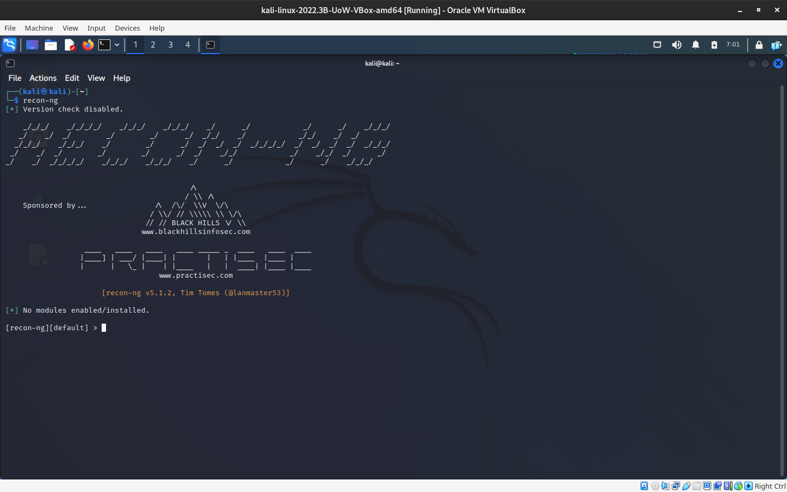
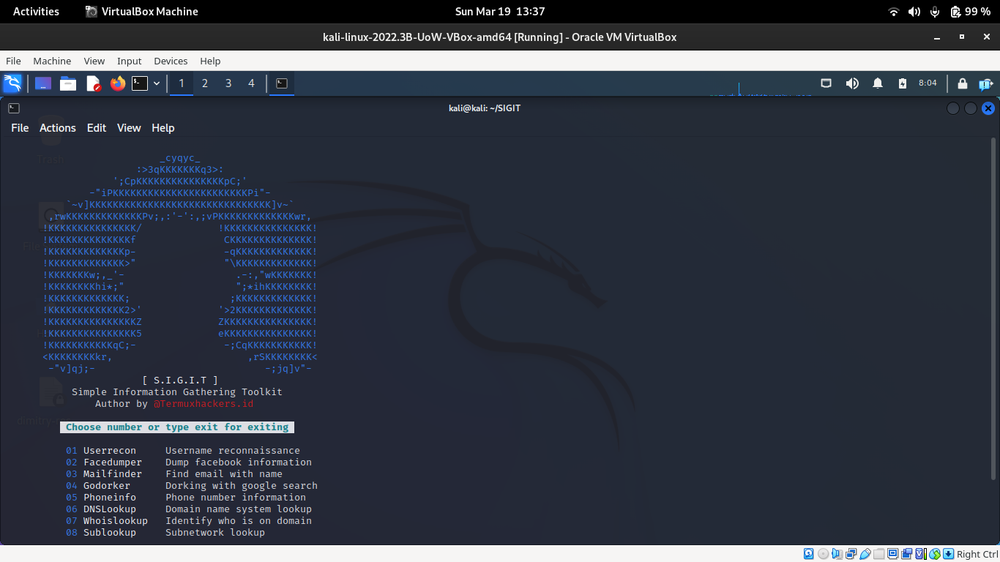
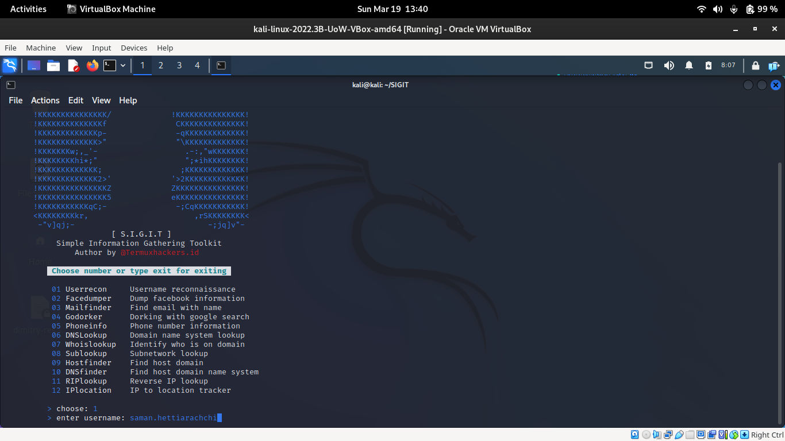
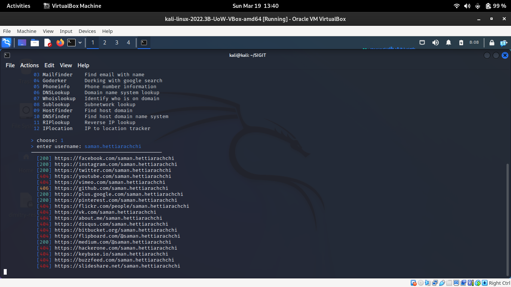

# Week 03 (Lab 03)

## Exploring the Vulnerable VM

:::{tip}
In this section since we are accessing services from OWASP VM. Set Network settings to [Host-Only](week_01.md/#isolated-network).
:::

### Broken Web App's in OWASP
Let's Access the OWASP Broken Web Applications via Web Browser. 

- Start both Kali and OWASP VM's
- Ensure the VM's can [communicate](./week_01.md/#communicating-among-vms)
- Open a web browser in Kali and navigate to `192.168.56.102`(Presuming this is the OWASP'S IP address)



#### Damn Vulnerable Web Applications

|      DVWA  |credentials|
|------------|--------|
|**username**|admin   |
|**password**|admin   |



All the applications of DVWA are listed in left bar menu. Eg :- Brute Force,SQL Injection.

#### WebGoat V5.4 

|      WebGoat  |credentials|
|------------|----------|
|**username**|webgoat   |
|**password**|webgoat   |


Web Goat has a customer portal which can be used to manipulate and exploit.


## Passive Reconnaissance - Open Source Intelligence (OSINT)

:::{tip}
In this section since we are accessing Internet Set network setting to [NAT.](./week_01.md/#internet-connected)
:::

Here we will observe and utilize tools available in Kali VM to conduct OSINT operations. 

### Harvester

This is tool which can be used to look into information which are already available online. 

Running this tool won't most likely trigger any alarms. 

```bash
# -d is for the target domain
# -b is for the data source google,bing or all
# -l is to limit the list of values
theHarvestor -d iit.ac.lk -b google -l 100
```

**It is important to save data. Allowing to gather first and analyze after**

```bash
# here -f will create a report which can be later observed
theHarvester -d cwkscenario.site -b all -f harvesterCwkScenario.html
```


### Spiderfoot

Spiderfoot is another OSINT tool.
It comes with Web Interface to conduct scans

- first let's start the service

:::{attention}
**When starting spiderfoot it is recommend to provide port higher than 5000 to avoid conflicts**
:::

```bash
# -l is to set a port for the service to run
spiderfoot -l 127.0.0.1:5001
```


- Open a web browser and goto `http://localhost:5001`(Persuming this would be the port you provide)

- In the Spiderfoot UI,
    - Set Scan Name
    - Set target domain
    - Scan type



- After few moments UI will be loaded with scanned information and will be updated with each scan cycle.



### Recon-ng

Recon-ng is another OSINT tool which support even more data sources like Twitter and shodan.

It is customizable tool where you can add more modules

- Initialize CLI tool

```bash
recon-ng
```



- Add `hackertarget` module to recon-ng

```bash
# use recon-ng marketplace to install a module hackertarget
marketplace install hackertarget
[*] Module installed: recon/domains-hosts/hackertarget
[*] Reloading modules...
```
- load the module
```bash
# loading hackertarget module
 modules load hackertarget
```
- set source for the operation

```bash
options set source cwkscenario.site #set source 
SOURCE => cwkscenario.site
```
- start the execution

:::{error}
Recon-ng module fails. Not enough resources to identify the issue. most likely an error with env.

[Issue](https://github.com/lanmaster53/recon-ng/issues/65)
:::

```bash
# starts the hackertarget module
run
```

### SIGIT (Simple Information Gathering Toolkit)

With this tool kit you specify more internal subjects.
- usernames
- emails
- ip address and more.

You can get the tool from their [GitHub](https://github.com/termuxhackers-id/SIGIT.git) page.

```bash
# first clone from git hub
# move into the cloned project
# make the kali installation script executable
# run the script `installkali.sh` to install dependencies
sudo git clone https://github.com/termuxhackers-id/SIGIT.git
cd ./SIGIT
sudo chmod +x installkali.sh
sudo ./installkali.sh
```
- start the tool by running command `sigit`

```bash
sigit
```


- select a option number and enter that menu
- provide the relevant info for the prompt 


- let the gathering process complete 


